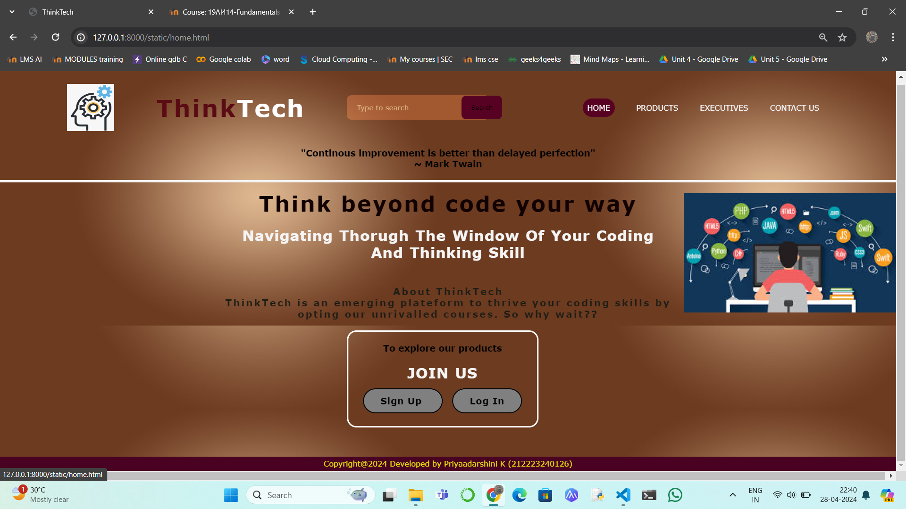
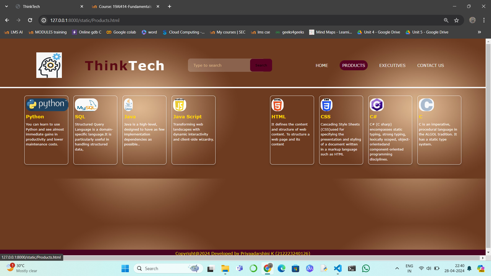
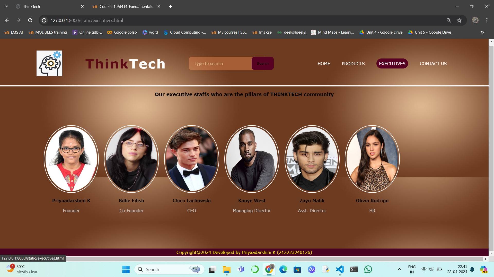
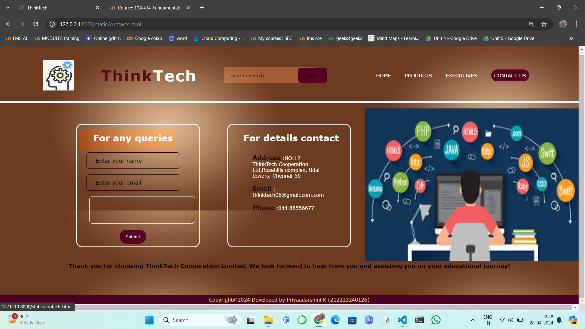

# Ex.07 Software Product Company Website
## Date: 27-04-24

## AIM:
To develop a static company website to display the softwares and services provided by the company.

## DESIGN STEPS:

### Step 1:
Requirement collection.

### Step 2:
Creating the layout using HTML and CSS.

### Step 3:
Updating the sample content.

### Step 4:
Choose the appropriate style and color scheme.

### Step 5:
Validate the layout in various browsers.

### Step 6:
Validate the HTML code.

### Step 7:
Publish the website in the given URL.

## PROGRAM:
```
home.html
<html>
    <head>
        <meta name="viewport" content="width=device-width, initial-scale=1.0">
        <title>ThinkTech</title>
        <style type="text/css">
            * {
                margin: 0;
                padding: 0;
                font-family: 'Garmond',Verdana, Geneva, Tahoma, sans-serif;
                        }
            .banner {
                width: 100%;
                height: 95vh ;
                background-size: cover;
                background-position: center;

            }
            .navbar {
                width: 85%;
                margin: auto;
                padding: 35px 0;
                display: flex;
                align-items: center;
                justify-content: space-between;
            }
            .logo {
                color:rgb(91, 11, 20);
                font-size: 50px;
                font-weight: 800;
                letter-spacing: 3px;
            }
            span {
                color: white;
            }
            form {
                width: 300px;
                height: 50px;
                display: flex;
                background: rgba(255, 255, 255, 0.179);
                padding: 1px 1px;
                font-size: 15px;
                border-radius: 10px;
                backdrop-filter: blur(4px) saturate(180%);
            }
            form input {
                background: transparent;
                flex: 1;
                border: 0;
                outline: none;
                padding: 12px 20px;
                font-size: 15px;
                color: white;
            } 
            ::placeholder {
                color: burlywood;
            }
            form button {
                border: 0;
                outline: none;
                padding: 5px 20px;
                color:black;
                border-radius: 10px;
                background:rgb(88, 2, 35);
                cursor: pointer;
            }
            .navbar li {
                list-style: none;
                display: inline-block;
                margin: 0 20px;
                position: relative;
            }
            .navbar li a {
                text-decoration: none;
                color: whitesmoke;
                text-transform: uppercase;
            }
            .navbar li:hover {
                border: 1px;
                padding: 10px;
                color: grey;
                background-color:rgb(88, 2, 35);
                transition: 0.5s; 
                cursor: pointer;
                border-radius: 40px;
            }
            .content {
                position: absolute;
                top: 50%;
                left: 50%;
                transform: translate(-50%,-50%);
                text-align: center;
            }
            .text h2 {
                color: rgb(17, 1, 1);
                font-weight: 800;
                font-size: 45px;
                letter-spacing: 3px;
            }
            .text h3{
                color: rgb(31, 29, 22);
                font-weight: 800;
                font-size: 20px;
                letter-spacing: 3px;
            }
            .text p {
                color: whitesmoke;
                text-transform: capitalize;
                font-size: 30px;
                margin-bottom: 30px;
                word-spacing: 2px;
                letter-spacing: 1px;
            }
            .login {
                margin: 0px 10px;
                border: 2px solid black;
                padding: 13px 35px;
                letter-spacing: 1px;
                color:black;
                border-radius: 30px;
                background-color: grey;
                text-decoration: none;
            }
            .login:hover {
                border: 2px solid rgb(255, 0, 102);
                color: grey;
                background-color: black;
                transition: 0.5s;
                cursor: pointer;
            } 
            .box-1 {
                height: 200px;
                width: 400px;
                border: 3px solid white;
                border-radius: 20px;
                background: transparent;
                position: relative;
                left: 260px;
                text-align:"right";
            }
            .signup {
                margin: 0px 10px;
                border: 2px solid black;
                padding: 13px 35px;
                letter-spacing: 1px;
                color:black;
                border-radius: 30px;
                background-color:  grey;
                text-decoration: none;
            }
            .signup:hover {
                border: 2px solid rgb(255, 0, 102);
                color: grey;
                background-color: black;
                transition: 0.5s;
                cursor: pointer;
            }
            .join {
                margin: 0px 10px;
                border: 2px solid black;
                padding: 13px 35px;
                letter-spacing: 1px;
                color:black;
                border-radius: 30px;
                background-color:  grey;
                text-decoration: none;
            }
            .join:hover {
                border: 2px solid rgb(255, 0, 102);
                color: grey;
                background-color: black;
                transition: 0.5s;
                cursor: pointer;
            }
            .footer {
                display: block;
                width: 100%;
                height: 25px;
                background-color: #490221;
                text-align: center;
                padding-top: 5px;
                margin: 0px 0px 0px 0px;
                color: #e8e109;
            }
        </style>
    </head>
<body background="bgpic.png">
    <div class="banner">
        <div class="navbar">
            
            <h1 class="logo">Think<span>Tech</span></h1>

            <form action="" method="get">
                <input class="placeholder" type="search" name="" placeholder="Type to search">
                <button type="submit"> Search </button>
            </form>
            <br>
            <ul>
                <li><a href="home.html"> Home </a></li>
                <li><a href="Products.html"> Products </a></li>
                <li><a href="executives.html"> Executives </a></li>
                <li><a href="contacts.html"> Contact Us </a></li>
            </ul>
        </div>
        <h3><center>"Continous improvement is better than delayed perfection"</center></p>
        <p><center> ~ Mark Twain</center></p><br>
        <hr width="100%;" color="whitesmoke" size="5">
        <body>
                <br>
                
        </body>
        <div class="content">
            <br>
            <div class="text">
                <br><br>
                <h2 ><br><br>Think beyond code your way</h2>
                <br>
                <p>Navigating thorugh the window of your coding and thinking skill</p><br>
                <h3>About ThinkTech<br>
                    ThinkTech is an emerging plateform to thrive your coding skills by opting our unrivalled courses. So why wait??
                </h3>
                <br>
                
                <div class="box-1"> 
                    <h4><br>To explore our products</h4>
                    <br>
                    <p>JOIN US</p>
                    <a href="#" class="signup"> <b>Sign Up</b> </a>
                    <a href="#" class="login"> <b>Log In </b></a>
                </div>
            </div>
        </div>  
    </div>
    <div class="footer">
        <p>Copyright@2024 Developed by Priyaadarshini K (212223240126)</p>
    </footer>
</body>
</html>
```
```
Products.html
<html>
    <head>
        <meta name="viewport" content="width=device-width, initial-scale=1.0">
        <title>ThinkTech</title>
        <style type="text/css">
            * {
                margin: 0;
                padding: 0;
                font-family: 'Garmond',Verdana, Geneva, Tahoma, sans-serif;
                        }
            .banner {
                width: 100%;
                height: 95vh;
                background-size: cover;
                background-position: center;
            }
            .navbar {
                width: 85%;
                margin: auto;
                padding: 35px 0;
                display: flex;
                align-items: center;
                justify-content: space-between;
            }
            .logo {
                color:rgb(91, 11, 20);
                font-size: 50px;
                font-weight: 800;
                letter-spacing: 3px;
            }
            span {
                color: white;
            }
            form {
                width: 300px;
                height: 50px;
                display: flex;
                background: rgba(255, 255, 255, 0.2);
                padding: 1px 1px;
                font-size: 15px;
                border-radius: 10px;
            }
            form input {
                background: transparent;
                flex: 1;
                border: 0;
                outline: none;
                padding: 12px 20px;
                font-size: 15px;
                color: white;
            } 
            ::placeholder {
                color: burlywood;
            }
            .text p {
                color: whitesmoke;
                text-transform: capitalize;
                font-size: 30px;
                margin-bottom: 30px;
                word-spacing: 2px;
                letter-spacing: 1px;
            }
            form button {
                border: 0;
                outline: none;
                padding: 5px 20px;
                color:black;
                border-radius: 10px;
                background:rgb(88, 2, 35);
                cursor: pointer;
            }
            .navbar li {
                list-style: none;
                display: inline-block;
                margin: 0 20px;
                position: relative;
            }
            .navbar li a {
                text-decoration: none;
                color: whitesmoke;
                text-transform: uppercase;
            }
            .navbar li:hover {
                border: 1px;
                padding: 10px;
                color: black;
                background-color:rgb(88, 2, 35);
                transition: 0.5s; 
                cursor: pointer;
                border-radius: 40px;
            }
            .container {
                background: transparent;
                padding: 10px 5%;
                padding-bottom: 100px;
            }
            .container .box-container {
                display: grid;
                grid-template-columns: repeat(auto-fit, minmax(170px, 1fr));
                gap: 20px;
            }
            .container .box-container .box {
                color: black;
                box-shadow: 0 5px 10px rgba(0,0,0,.2);
                border-radius: 10px;
                background: transparent;
                border: 1px solid white;
                padding: 10px 5px;
            }
            .container .box-container .box img {
                height: 50px;
                border-radius: 20px;
            }
            .container .box-container .box h3 {
                color: gold;
                font-size: large;
                padding: 10px 0;
            }
            .container .box-container .box p {
                color: white;
                font-size: small;
                line-height: 1.5;
            }
            .footer {
                display: block;
                width: 100%;
                height: 25px;
                background-color: #490221;
                text-align: center;
                padding-top: 5px;
                margin: 0px 0px 0px 0px;
                color: #e8e109;
            }
        </style>
    </head>
<body background="bgpic.png">
    <div class="banner">
        <br>
        <div class="navbar">
            
            <h1 class="logo">Think<span>Tech</span></h1>
            
            <form action="" method="get">
                <input class="placeholder" type="search" name="" placeholder="Type to search">
                <button type="submit"> Search </button>
            </form>
            <br>
            <ul>
                <li><a href="home.html"> Home </a></li>
                <li><a href="Products.html"> Products </a></li>
                <li><a href="executives.html"> Executives </a></li>
                <li><a href="contacts.html"> Contact Us </a></li>
            </ul>
        </div>
        <hr width="100%;" color="whitesmoke" size="5">
        <br>
        <div class="container">
            <div class="box-container">
                <div class="box">
                    
                    <h3>Python</h3>
                    <p>You can learn to use Python and see almost immediate gains in productivity and lower maintenance costs.</p>
                </div>
                <div class="box">
                    
                    <h3>SQL</h3>
                    <p>Structured Query Language is a domain-specific language.It is particularly useful in handling structured data,</p>
                </div>
                <div class="box">
                    
                    <h3>Java</h3>
                    <p>Java is a high-level, designed to have as few implementation dependencies as possible..</p>
                </div>
                <div class="box">
                    
                    <h3>Java Script</h3>
                    <p>Transforming web landscapes with dynamic interactivity and client-side wizardry.</p>
                </div>
                <br>
                <div class="box">
                    
                    <h3>HTML</h3>
                    <p>It defines the content and structure of web content. To structure a web page and its content </p>
                </div>
                <div class="box">
                    
                    <h3>CSS</h3>
                    <p>Cascading Style Sheets (CSS)used for specifying the presentation and styling of a document written in a markup language such as HTML</p>
                </div>
                <div class="box">
                    
                    <h3>C#</h3>
                    <p> C# (C sharp) encompasses static typing, strong typing, lexically scoped, object-orientedand component-oriented programming disciplines.</p>
                </div>
                <div class="box">
                    
                    <h3>C</h3>
                    <p>C is an imperative, procedural language in the ALGOL tradition. It has a static type system.</p>
                </div>
            </div>
        </div>
    </div>
    <div class="footer">
        <p>Copyright@2024 Developed by Priyaadarshini K (212223240126)</p>
    </footer>
</body>
</html>
```
```
executives.html
<html>
    <head>
        <meta name="viewport" content="width=device-width, initial-scale=1.0">
        <title>ThinkTech</title>
        <style type="text/css">
            * {
                margin: 0;
                padding: 0;
                font-family: 'Garmond',Verdana, Geneva, Tahoma, sans-serif;
                        }
            .banner {
                width: 100%;
                height: 95vh;
                background-size: cover;
                background-position: center;
            }
            .navbar {
                width: 85%;
                margin: auto;
                padding: 35px 0;
                display: flex;
                align-items: center;
                justify-content: space-between;
            }
            .logo {
                color:rgb(91, 11, 20);
                font-size: 50px;
                font-weight: 800;
                letter-spacing: 3px;
            }
            span {
                color: white;
            }
            form {
                width: 300px;
                height: 50px;
                display: flex;
                background: rgba(255, 255, 255, 0.2);
                padding: 1px 1px;
                font-size: 15px;
                border-radius: 10px;
                backdrop-filter: blur(4px) saturate(180%);
            }
            form input {
                background: transparent;
                flex: 1;
                border: 0;
                outline: none;
                padding: 12px 20px;
                font-size: 15px;
                color: white;
            } 
            ::placeholder {
                color: burlywood;
            }
            form button {
                border: 0;
                outline: none;
                padding: 5px 20px;
                color:black;
                border-radius: 10px;
                background:rgb(88, 2, 35);
                cursor: pointer;
            }
            .navbar li {
                list-style: none;
                display: inline-block;
                margin: 0 20px;
                position: relative;
            }
            .navbar li a {
                text-decoration: none;
                color: whitesmoke;
                text-transform: uppercase;
            }
            .navbar li:hover {
                border: 1px;
                padding: 10px;
                color: white;
                background-color:rgb(88, 2, 35);
                transition: 0.5s; 
                cursor: pointer;
                border-radius: 40px;
            }
            .image {
                position: relative;
                border: 0;
                top: 70px;
                background: transparent;
            }
            .image table {
                border: 0;
                color: black;
                position: relative;
                left: 150px;
            }
            .image table img {
                height: 250px;
                width: 200px;
                border: 2px solid white;
                padding: 5px;
                border-radius: 100%;
            }
            .image table td {
                color: silver;
            }
            .footer {
                display: block;
                width: 100%;
                height: 25px;
                background-color: #490221;
                text-align: center;
                padding-top: 5px;
                margin: 0px 0px 0px 0px;
                color: #e8e109;
            }
        </style>
    </head>
<body background="bgpic.png">
    <div class="banner">
        <br>
        <div class="navbar">
            
            <h1 class="logo">Think<span>Tech</span></h1>
            
            <form action="" method="get">
                <input class="placeholder" type="search" name="" placeholder="Type to search">
                <button type="submit"> Search </button>
            </form>
            <br>
            <ul>
                <li><a href="home.html"> Home </a></li>
                <li><a href="Products.html"> Products </a></li>
                <li><a href="executives.html"> Executives </a></li>
                <li><a href="contacts.html"> Contact Us </a></li>
            </ul>
        </div>        
        <hr width="100%;" color="whitesmoke" size="5">
        <br>
        <h3><center>Our executive staffs who are the pillars of THINKTECH community</center>
        </h3>
        <br>
        <div class="image">
            <table cellspacing="20"> 
                <tr align="center">
                    <td>  </td>
                    <td>  </td>
                    <td>  </td>
                    <td>  </td>
                    <td>  </td>
                    <td>  </td>
                </tr>
                <tr align="center">
                    <th> Priyaadarshini K</th>
                    <th> Billie Eilish </th>
                    <th> Chico Lachowski </th>
                    <th> Kanye West </th>
                    <th> Zayn Malik </th>
                    <th> Olivia Rodrigo </th>
                </tr>
                <tr align="center">
                    <td> Founder </td>
                    <td> Co-Founder  </td>
                    <td> CEO </td>
                    <td> Managing Director </td>
                    <td> Asst. Director </td>
                    <td> HR</td>
                </tr>
            </table>
        </div>
    </div>
    <div class="footer">
        <p>Copyright@2024 Developed by Priyaadarshini K (212223240126)</p>
    </footer>
</body>
</html>
```
```
contacts.html
<html>
    <head>
        <meta name="viewport" content="width=device-width, initial-scale=1.0">
        <title>ThinkTech</title>
        <style type="text/css">
            * {
                margin: 0;
                padding: 0;
                font-family: 'Garmond',Verdana, Geneva, Tahoma, sans-serif;
                        }
            .banner {
                width: 100%;
                height: 95vh;
                background-size: cover;
                background-position: center;
            }
            .navbar {
                width: 85%;
                margin: auto;
                padding: 35px 0;
                display: flex;
                align-items: center;
                justify-content: space-between;
            }
            .logo {
                color:rgb(91, 11, 20);
                font-size: 50px;
                font-weight: 800;
                letter-spacing: 3px;
            }
            span {
                color: white;
            }
            form {
                width: 300px;
                height: 50px;
                display: flex;
                background: rgba(255, 255, 255, 0.2);
                padding: 1px 1px;
                font-size: 15px;
                backdrop-filter: blur(4px) saturate(180%);
            }
            form input {
                background: transparent;
                flex: 1;
                border: 0;
                outline: none;
                padding: 12px 20px;
                font-size: 15px;
                color: white;
            } 
            ::placeholder {
                color: black;
            }
            form button {
                border: 0;
                outline: none;
                padding: 5px 25px;
                color:black;
                border-radius: 10px;
                background:rgb(88, 2, 35);
                cursor: pointer;
            }
            .navbar li {
                list-style: none;
                display: inline-block;
                margin: 0 20px;
                position: relative;
            }
            .navbar li a {
                text-decoration: none;
                color: white;
                text-transform: uppercase;
            }
            .navbar li:hover {
                border: 1px;
                padding: 10px;
                color: white;
                background-color:rgb(88, 2, 35);
                transition: 0.5s; 
                cursor: pointer;
                border-radius: 40px;
            }
            .queries { 
                margin-left:600px;
            }
            .box {
                display: flex;
                column-gap: 40px;
                background: transparent;
                position: relative;
                top: 50px;
            }
            .box-1 {
                height: 400px;
                width: 400px;
                border: 3px solid white;
                border-radius: 20px;
                background: transparent;
                position: relative;
                left: 250px;
            }
            .box-2 {
                height: 400px;
                width: 400px;
                border: 3px solid whitesmoke;
                border-radius: 20px;
                background: transparent;
                position: relative;
                left: 300px;
            }
            .box-1 form {
                display: flex;
                color: white;
                background: transparent;
                padding: 10px;
                font-size: 15px;
                position: relative;
                top: 15px;
            }
            .box-1 form input {
                background: transparent;
                display: flex;
                border: 1px solid rgb(30, 4, 4);
                border-radius: 10px;
                padding: 15px 30px;
                font-size: 18px;
                color: white;
                position: relative;
                top: 30px;
            }
            .box-1 form textarea {
                background: transparent;
                color: rgb(32, 7, 7);
                padding: 15px 10px;
                position: relative;
                top: 30px;
                left: 30px;
                border: 1px solid white;
                border-radius: 10px;
            }
            .box-1 form button {
                border: 0;
                outline: none;
                padding: 15px 20px;
                color: white;
                border-radius: 30px;
                background: rgb(88, 2, 35);
                cursor: pointer;
                position: relative;
                top: 50px;
            }
            .box-2 h2 {
                color: white;
                position: relative;
                top: 25px;
                left: 50px;
                font-size: 30px;
            }
            .box-2 p {
                color: white;
                position: relative;
                top: 50px;
                padding: 10px 80px;
            }
            .box-2 span {
                color: rgb(35, 6, 6);
                font-size: 20px;
            }
            .footer {
                display: block;
                width: 100%;
                height: 25px;
                background-color: #490221;
                text-align: center;
                padding-top: 5px;
                margin: 0px 0px 0px 0px;
                color: #e8e109;
            }
        </style>
    </head>
<body background="bgpic.png">
    <div class="banner">
        <br>
        <div class="navbar">
            
            <h1 class="logo">Think<span>Tech</span></h1>
            
            <form action="" method="get">
                <input class="placeholder" type="search" name="" placeholder="Type to search">
                <button type="submit"> Search </button>
            </form>
            <br>
            <ul>
                <li><a href="home.html"> Home </a></li>
                <li><a href="Products.html"> Products </a></li>
                <li><a href="executives.html"> Executives </a></li>
                <li><a href="contacts.html"> Contact Us </a></li>
            </ul>
        </div>
        <hr width="100%;" color="whitesmoke" size="5">
        <body>
            <br>
            
        </body>
        <div class="box">
            <div class="box-1">
                <form>
                    <center>
                        <h1>For any queries</h1>
                        <input type="text" placeholder="Enter your name">
                        <br>
                        <input type="email" placeholder="Enter your email">
                        <br>
                        <textarea rows="4" cols="30" placeholder="Any comments"> </textarea>
                        <br>
                        <button type="submit"> Submit </button>
                    </center>
                </form>
            </div>
            <div class="box-2"> 
                <h2> For details contact</h2>
                <p> <span><b>Address</b> </span> :NO:12 ThinkTech Cooperation Ltd,Rosehills complex, tidal towers, Chennai-50 </p>
                <p> <span><b>Email</b></span> : thinktech06@gmail.com.com </p>
                <p> <span><b>Phone</b> </span> :044 88556677</p>
            </div>
        </div>
        <br>
        <br>
        <br>
        <br><h3><center><br>Thank you for choosing ThinkTech Cooperation Limited. We look forward to hear from you and assisting you on your educational journey!</center>
    </div>
    </h3>
    <div class="footer">
        <p>Copyright@2024 Developed by Priyaadarshini K (212223240126)</p>
    </footer>
</body>
</html>
```

## OUTPUT:









## RESULT:
The program for designing software company website using HTML and CSS is completed successfully.
